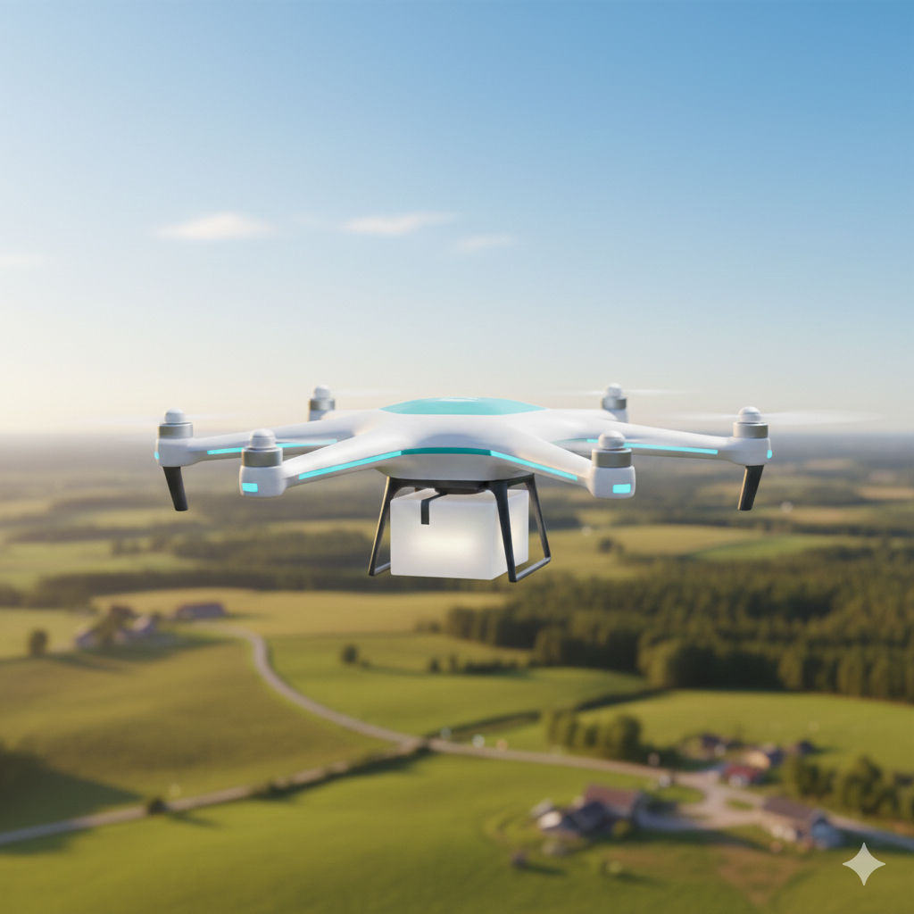

# safetofly:

## Advancing UAV Reliability and Societal Trust Through Integrated Testing and Formal Verification

The Safe-2-Fly project addresses the safety challenges of autonomous Unmanned Aerial Vehicles (UAVs) by bridging the gap between practical testing and theoretical formal verification. 

Recognizing that field testing is unscalable and formal methods are often computationally infeasible, the project proposes a hybrid, interdisciplinary approach involving experts in robotics, software engineering, and logic. 

By employing specification mining to extract behavioral rules from execution traces, Safetofly creates machine-readable safety standards that can be used for both automated test generation and real-time flight monitoring. 
Ultimately, this integration aims to eliminate *hidden gaps* in system reliability, ensuring UAVs can navigate complex environments safely while strengthening societal trust in intelligent autonomous technologies.

This project is funded by the [Hasler Foundation](https://haslerstiftung.ch/) and includes work packages as follows: 

### Formal Modeling of Unsafety and Uncertainty in Simulation-based Testing of UAV 

Simulation-based testing has emerged as a key enabler for validating UAV software at scale. 
Frameworks such as [Aerialist](https://skhatiri.github.io/Aerialist-Project/) allow developers to execute thousands of simulated flights under diverse environmental, mission, and configuration conditions, avoiding the risks and costs of real-world testing.
However, simulation-based testing introduces new challenges, particularly related to uncertainty and non-deterministic behaviors, where the same test case may produce different outcomes across executions.

Recent empirical studies show that uncertainty in UAV behavior can be a major contributor to unsafe outcomes, yet uncertainty is often treated implicitly or ignored in current testing pipelines.
There is a lack of formal, explicit models that characterize uncertainty and safety jointly, and that can be systematically applied to UAV simulation data.

The **goal** of this thesis is to design, implement, and empirically evaluate formal methods-based models for safety and uncertainty in simulation-based testing of UAVs.

